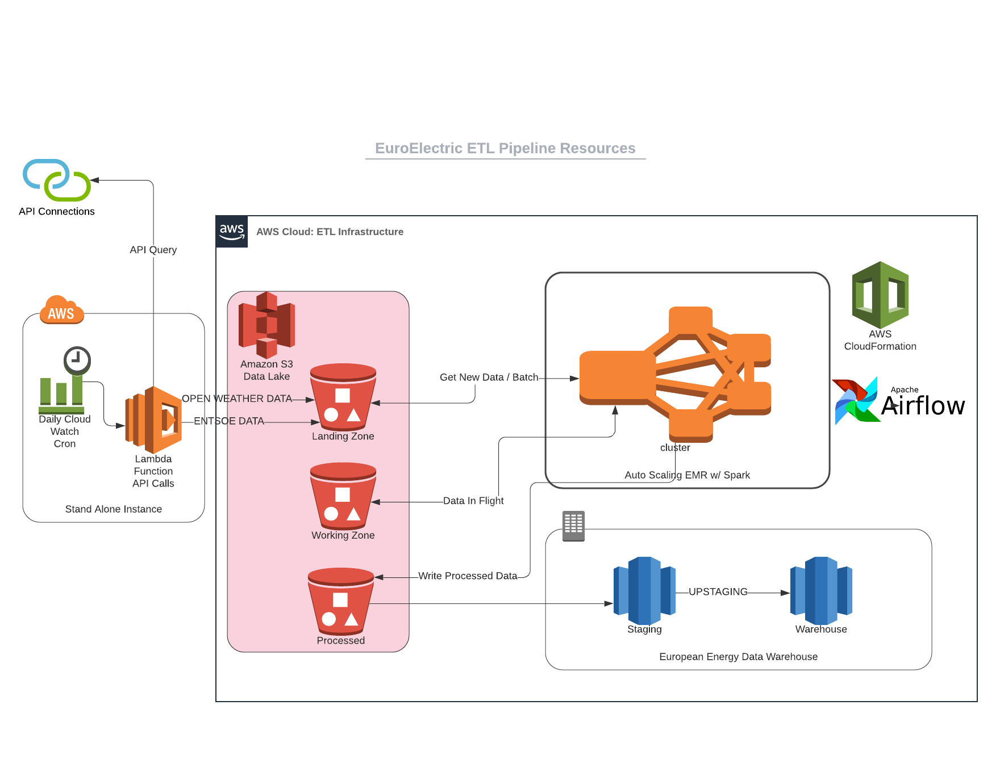

# ENTSOE ETL PIPELINE

Entsoe ETL pipeline combines data from the European Network Of Transmission System Operators, and Open Weather API to create a data lake, warehouse, and analyitcs platform. The platform is a useful dataset for investigating, analyzing, and modelling european energy generation and consumption.

**Project Status: In Development**

## Introduction and Context

This project builds a Redshift and ETL pipeline for sparkify a muisc streaming service. As their userbase has grown Sparkify needs to scale up their database. Using original log files in JSON format this project builds the schema and ingestion scripts with python and SQL to propigate the new Redshift service.

## Resouces Architecture

The project consists of two parts.
- Data capture. An automated lambda function managed with cloud watch and stores raw data daily at 0200GMT.
- Data processing and warehouse. An ETL that runs daily or in batch mode and generates a data warehouse in redshift.

### Pipeline Modules
1. API wrappers
  - Raw electrical consumption and demand data with the [ENTSOE API wrapper entsoe-py](https://github.com/EnergieID/entsoe-py)
  - Weather data from the open weather API wrapper [pyowm](https://github.com/csparpa/pyowm)
2. ETL jobs and Airflows scheduler
3. Redshift warehouse module

### Database Schema
The proposed data warehouse schema is a star model. The specific schema can be seen in the figure below.

