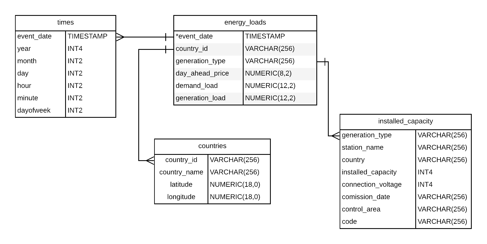

# European Energy Data Warehouse

European Energy Data Warehouse is a simple ETL that combines data on day ahead prices, demand, generation, and installed capacity for 10 european countries. The data comes from 5 different sources within the European Network of Transmission System Operators portal.

**Project Status: Complete**

## Project Scope
This project uses Apache Airflow to build an energy data warehouse in AWS redshift. Data is processed locally and uploaded to s3 with the scripts in ```src/```. Apache airflow can then be launched (setup instructions below) along side a redshift cluster to build the data warehouse.

## Accessing the data
All data in this project is available publicly though the [ENTSOE Transparency portal](https://transparency.entsoe.eu/). It can be accessed by API or through downloadable CSVs. A sample of raw and processed data is available in the ```data/``` folder.

### Data Cleaning and Preparation
A description of the data cleaning steps and the functions developed is found in ```notebooks/data-cleaning-functions```.

## Architecture
The current implementation runs the data cleaning and airflows task scheduler in a local environment and connects to AWS redshift to stage and create the warehouse. The diagram below describes the local architecture.


Spark could be used with the project to clean and process the raw data in preparation for staging. Airflows is already used as a task manager in the project but like spark could be adapted for use in the cloud. To move to the cloud, airflows could be hosted on cloud formation, and spakr deployed within an EMR cluster. See below in the section on scaling up the project for more details on how this could be done. A diagram of the DAG used in this project is below.


## Schema
A star schema was chosen to model the data. This allows fast easy queries on the facts table. In this case the energy_loads table contains data on day ahead prices, total energy demand, and energy generation by production type. The dimension tables provide additional information on country location, times, and installed capacity by country and production type. This structure allows queries that combine supply, generation, and price all together.



## Data Dictionary

#### energy_loads
- Table name: ```energy_loads```
- Type: facts table

| Column | Type | Description |
| ------ | ---- | ----------- |
| `event_date` | `TIMESTAMP NOT NULL` | Full timestamp of when event occurred |
| `country_id` | `VARCHAR(256)` | Two letter country code  |
| `generation_type` | `VARCHAR(256)` | Type of electrical generation i.e. Solar, Coal, etc.  |
| `day_ahead_price` | `NUMERIC(8,2)` | Price in euros for day ahead settlement market |
| `demand_load` | `NUMERIC(12,2)` | Electrical energy demaned in metawatts |
| `generation_load` | `NUMERIC(12,2)` | Eletrical energy generated in megawatts |

#### installed_capacity
- Table name: ```installed_capacity```
- Type: dimension table

| Column | Type | Description |
| ------ | ---- | ----------- |
| `generation_type` | `VARCHAR(256) NOT NULL` | Type of electrical generation i.e. Solar, Coal, etc. |
| `station_name` | `VARCHAR(256) NOT NULL` | Name of the generation plant |
| `country_id` | `VARCHAR(256) NOT NULL` | Two letter country code |
| `installed_capacity` | `INT4` | Generation capacity in megawatts (MW)  |
| `connection_voltage` | `INT4` | Transmission connection voltage in Volts. |
| `commission_date` | `VARCHAR(256)` | Date plant started operations  |
| `control_area` | `VARCHAR(256)` | Market control area within transmission system |
| `code` | `VARCHAR(256)` | Generation station identifier code |

#### countries
- Table name: ```countries```
- Type: dimension table

| Column | Type | Description |
| ------ | ---- | ----------- |
| `country_id` | `VARCHAR(256)` | Two letter country code |
| `country_name` | `VARCHAR(256)` | Country full name  |
| `latitude` | `NUMERIC(18,0)` | Latitude of national capital |
| `longitude` | `NUMERIC(18,0)` | Longitude of national capital  |

#### times 
- Table name: ```times```
- Type: dimension table

| Column | Type | Description |
| ------ | ---- | ----------- |
| `event_date` | `TIMESTAMP NOT NULL` | Full timestamp of when event occurred |
| `year` | `INT2` | Year event occurred  |
| `month` | `INT2` | Month event occurred  |
| `day` | `INT2` | Day event occurred  |
| `hour` | `INT2` | Hour event occurred |
| `minute` | `INT2` | Minute event occurred  |
| `dayofweek` | `INT2` | Day of week event occurred (i.e. 1 for monday) |


## Setup: How to run the ETL
1. Download datasets from ENTSOE in CSV format placing them in the ```data/raw/``` folder below the corresponding data type and country. Then run ```python3 src/process_upload.py```. You will need to set your AWS credentials in your environment variables. This will clean, process, and upload the files to be staged in redshift to S3. An example set of raw and processed files are included in the repo. The countries CSV can be found in ```data/```
2. Build the docker image for Apache Airflow by running the following in your project root.
    - Build the image ```docker build -t puckel/docker-airflow .```
    - Generate the FERNET_KEY ```docker run puckel/docker-airflow python -c "from cryptography.fernet import Fernet; FERNET_KEY = Fernet.generate_key().decode(); print(FERNET_KEY)"```
    - Set the FERNET_KEY  ```docker run -d -p 8080:8080 -e FERNET_KEY="{your key here}" puckel/docker-airflow webserver``` This can also be done by adding ```FERNET_KEY={your key}``` under ```environment``` in ```docker-compose-LocalExecutor.yml```
    - Compose and launch the image ```docker-compose -f docker-compose-LocalExecutor.yml up -d```
    - Navigate to ```http://localhost:8080/```
3. Before launching the DAG setup a redshift instance with S3 and public connection access. Add your AWS credentials and redshift host as connections in airflow. [See this link for more detials.](https://github.com/san089/goodreads_etl_pipeline/blob/master/docs/Airflow_Connections.md) 

## ETL workflow
1. Data is processed locally and uploaded to S3. This works for small volumes of data, but for larger situations could be moved to an EMR instance.
2. From S3 data is staged in redshift
3. Quality checks run and ensure no missing values
4. Facts table is upserted from staged tables.
5. Quality check on facts table checks for minimum number of rows inserted
6. Dimension tables are upserted from staging.

## Scenarios for Scaling Up the Project
The current project builds the data warehouse using 2019 data from a local machine and manually downloaded CSVs. In scaling the project to a higher frequency it could be adapted to run at monthly, or daily frequency. Several steps would be needed to do this. First, would be to automate calls to the ENTSOE API. Second, store the raw data in an S3 bucket, and run processing to clean the data and store it in a separate bucket with all processed files. Third, rewrite the processing scripts in pyspark and host the job on a EMR cluster. Finally, host the local airflows instance with AWS cloud formation so it can run independently from the local machine. In the diagram below we see a diagram of how this architecture would look like.


**If the data was increased by 100x**

In this situation we would rewrite the cleaning scripts in pyspark and host airflows in cloud formation to allow us to process using a EMR cluster. Redshift would still be a suitable choice for the increased load.

**If the pipelines were run on a daily basis by 7am**

The Airflow dag could be easily configured to run at any interval above daily frequency. To automate on daily frequency or higher a module that queries the ENTSOE API would be needed.

**If the database needed to be accessed by 100+ people**

Making the warehouse available for 100+ people we could increase the number of nodes in redshift. Adding a concurrency condition would allow a maximum number of requests/time period per node. With this set redshift would scale as needed to the demand for reads. 


