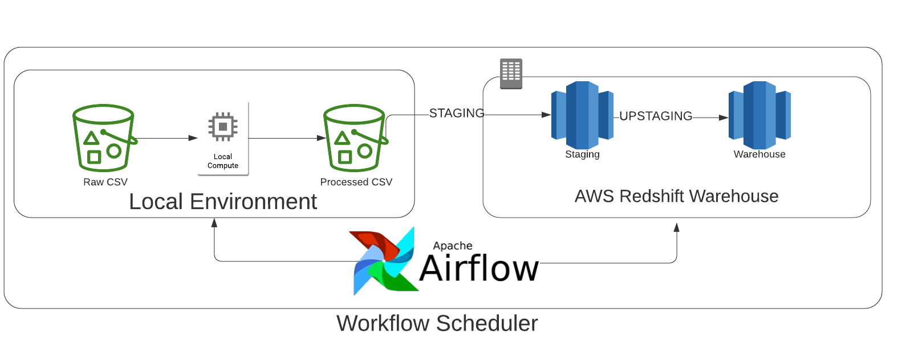
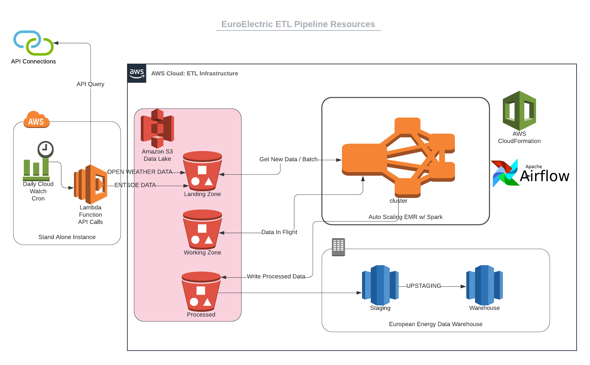

# European Energy Data Warehouse

European Energy Data Warehouse is a simple ETL that combines data on day ahead prices, demand, generation, and installed capacity for 9 european countries. The data comes from the European Network of Transmission System Operators.

**Project Status: In Development**

## Project Scope
This 

What's the goal?


## Accessing the data
All data in this project is available publicly though the ENTSOE Transparency portal. It can be accessed by API or through downloadable CSVs. A sample of raw and processed data is available in the ```data/``` folder.


## Data Model
### Architecture
The current implementation runs the data cleaning and airflows task scheduler in a local environment connecting to redshift to stage and create the warehouse. The diagram below describes the local architecture.


Spark could be used with the project to clean and process the raw data in preparation for staging. Airflows is already used as a task manager in the project but like spark could be adapted for use in the cloud. To move to the cloud, airflows could be hosted on cloud formation, and spakr deployed within an EMR cluster. See below in the section on scaling up the project for more details on how this could be done.


### Schema
A star schema was chosen to model the data. This allows fast easy queries on the facts table. In this case the energy_loads table contains data on day ahead prices, total energy demand, and energy generation by production type. The dimension tables provide additional information on country location, times, and installed capacity by country and production type. This structure allows queries that combine supply, generation, and price all together.


## How to run the ETL


## Scenarios for Scaling Up the Project
The current project builds the data warehouse using 2019 data from a local machine and manually downloaded CSVs. In scaling the project to a higher frequency it could be adapted to run at monthly, or daily frequency. Several steps would be needed to do this. First, would be to automate calls to the ENTSOE API. Second, store the raw data in an S3 bucket, and run processing to clean the data and store it in a separate bucket with all processed files. Third, rewrite the processing scripts in pyspark and host the job on a EMR cluster. Finally, also host the local airflows instance with AWS cloud formation so it can run independently from the local machine. In the diagram below we see a diagram of how this architecture would look like.



**If the data was increased by 100x**

In this situation we would rewrite the cleaning scripts in pyspark and host airflows in cloud formation to allow us to process using a EMR cluster. Redshift would still be a suitable choice for the increased load.

**If the pipelines were run on a daily basis by 7am**

The Airflow dag could be easily configured to run at any interval above daily frequency. To automate on daily frequency or higher a module that queries the ENTSOE API would be needed.

**If the database needed to be accessed by 100+ people**

Making the warehouse available for 100+ people we could increase the number of nodes in redshift. Adding a concurrency condition would allow a maximum number of requests/time period per node. With this set redshift would scale as needed to the demand for reads. 


